# Azure Serverless 101

This lab will walk you through building a serverless integration app.  The three components we will be building on are:
* Azure Logic Apps - serverless workflows
* Azure Functions - serverless compute
* Azure Event Grid - serverless events

The scenario will be for customer support lifecycle.  A customer will email a support ticket that looks like the following:

```
CustomerName:Jeff Hollan
CustomerEmail:jehollan@microsoft.com
Issue:Purchase
Details:Didn't get order confirmation
```

We need to trigger whenever we get an email like this, parse it, and emit an event "Support ticket recieved."

## Trigger on support email

To begin we will trigger whenever we recieve a support email.  For this you require either:

* Office 365 mail account
* Gmail.com mail account
* Outlook.com mail account

**Be sure to use the trigger associated with the mail account you are using for testing**.  You may just want to [sign up for a free outlook.com mailbox](https://outlook.live.com/owa/?nlp=1&signup=1) for development purposes.

1. Go to [the Azure Portal](http://portal.azure.com)
1. Create a new resource, select **Enterprise Integration**, and choose **Logic Apps**  
    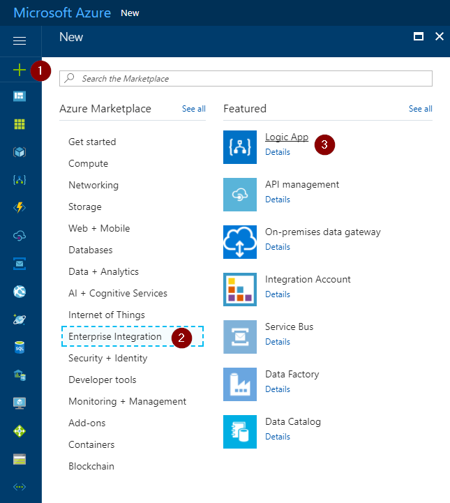  
1. Name your logic app `on-support-email`, create a new resource group, and place in any location you prefer.  Pin to your dashboard, and click **Create**  
    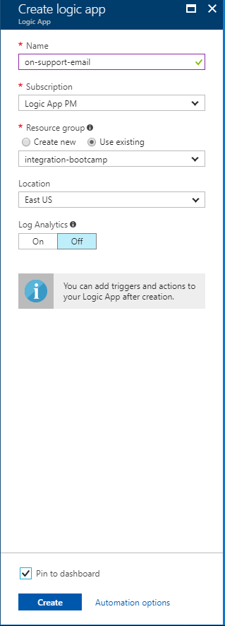  
1. After your logic app has deployed, it *should* open automatically.  If not, open the logic app you just deployed.  The designer should load by default, but if not click the **Edit** button on the top of the resource to enter the designer.
1. Click the **Blank Logic App** template
1. Select the Email Service you are using (I'm going to be using an outlook.com account for this, but Gmail or Office 365 work if you have one)
1. Select the **When a new email arrives** trigger  
    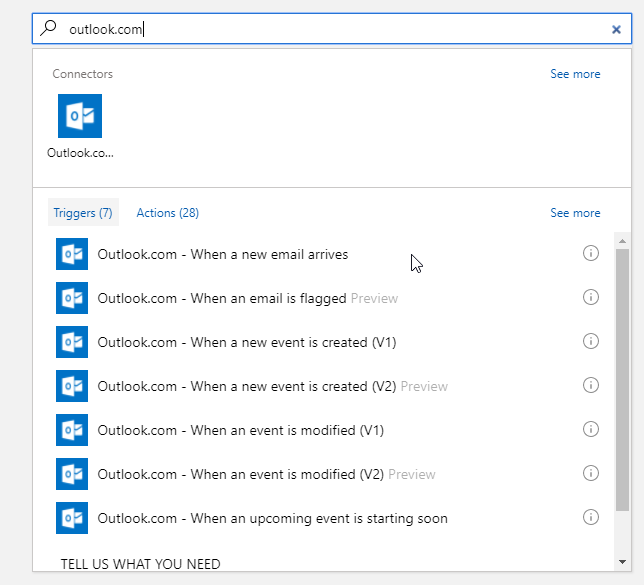  
1. Authenticate with your email provider - your credentials are never stored.  We use OAuth to obtain an access token, and encrypt and store it within Azure Key Vault.
1. You can specify the recurrence interval for checking the mailbox.  However you can always check faster for testing purposes.  For now I'm going to leave at 3 minutes as there is a micro-charge for every poll.  You can even switch to 3 hours if you want - we will be manually polling during this lab for the most part.
1. Save your logic app, and click the **Run** button to poll your mailbox every 3 seconds until it triggers.  Send an email to your account to watch the trigger fire.  
    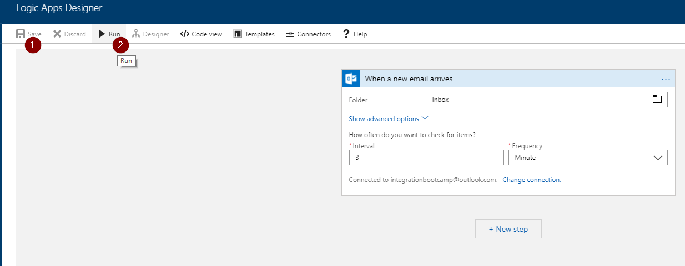  
1. You should see your trigger eventually fire.  You can look at the outputs to understand what the trigger returns.  
    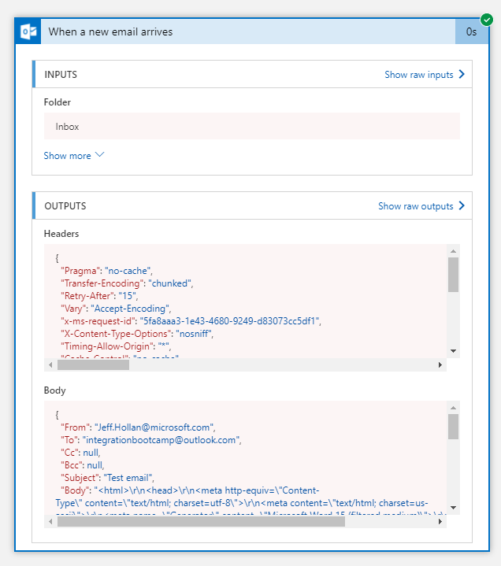  
1. Click to enter the designer again.  Let's add one more step to convert the email to plain text.  Click **Add Action** and select the **Html to text** action (in Content Conversion).
1. Pass in the email body to convert to plain text.  
    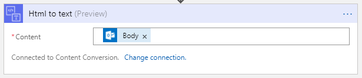  
1. Save your logic app. You can even run it and test it again to see what the Html to text does.  If you don't want to send another email, you can open your last run and "Resubmit" it to simulate another email.  

Next we will write an Azure Function that will parse these results and help us fire the appropriate event.

## Creating an Azure Function to parse customer emails

1. Close the Logic App and create a new resource in Azure.  Select the **New** button, choose **Compute** and select an **Azure Function**.  
    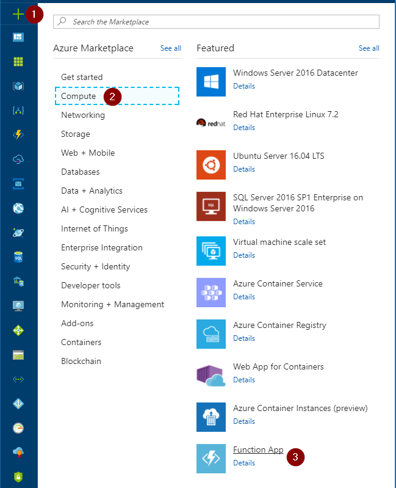  
1. Give it a **globally unique** name, select a resource group and location, pin it to your dashboard, and select **Create**.
    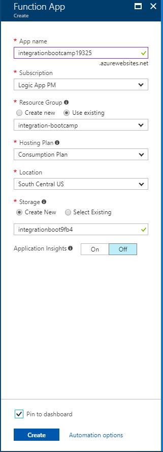  
1. Once your function app has created, select it on your dashboard (or under all resources).
1. Select the **+** sign next to "Functions" to create a new Azure Function in your app.  You can leave the defaults (HttpTrigger C#).  
    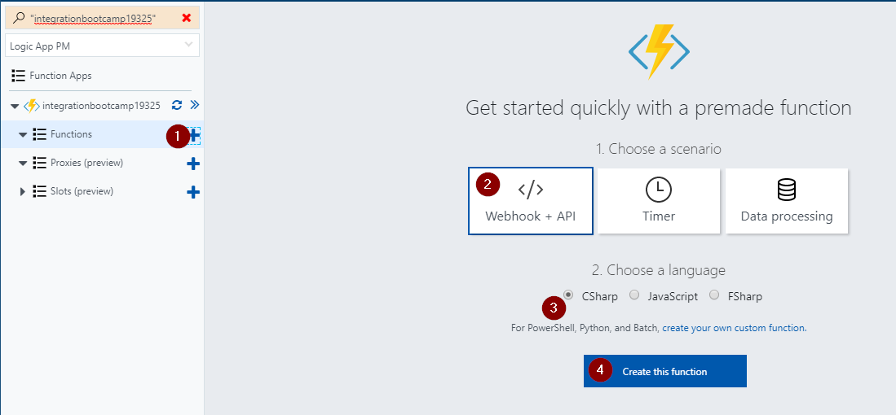  
1. This is the Azure Portal editor. You can always create your Azure Functions locally, but for now we will just paste our C# script here.  Paste in the following code to replace your Function: [source code](src/azurefunction.csx)
1. Open the **Test** pane on the right and test it out. Include the following **Request body**:  
    ```
    CustomerName:Jeff Hollan
    CustomerEmail:jehollan@microsoft.com
    Issue:Purchase
    Details:Didn't get order confirmation
    ```
1. Press the **Run** button and ensure the right object is returned:  
    ```json
    {
        "CustomerName": "Jeff Hollan",
        "CustomerEmail": "jehollan@microsoft.com",
        "Issue": "Purchase",
        "Details": "Didn't get order confirmation"
    }
    ```  
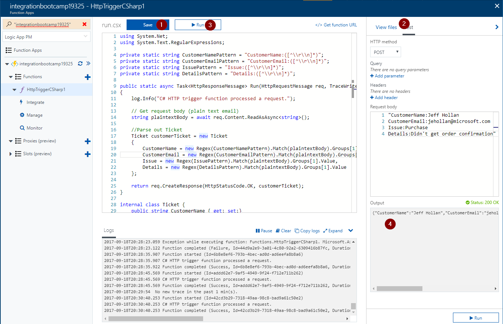

We have now successfully written an Azure Function (HttpTriggerCSharp) that will parse out our email and pull out the necessary details.

## Calling the Azure Function from Logic Apps

1. Close your Azure Function and re-open the Azure Logic App from the first section.
1. Click **Edit** on the top to enter the designer
1. Add a step, select **Azure Functions** and navigate to the Azure Function you just created.
1. Pass in the Plain Text outputs of the previous step.  
    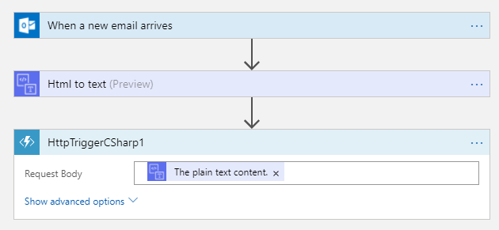  
1. Click **Save**, and press the **Run** button to poll for new email.
1. Open a mail client and send an email to the listening mailbox.  Send the following email:  
    ```
    CustomerName:Jeff Hollan
    CustomerEmail:jehollan@microsoft.com
    Issue:Purchase
    Details:Didn't get order confirmation
    ```
1. Wait for the logic app to fire, and observe the function called and correctly returned back the parsed email.
1. Click the **Designer** button on the top bar, and add a **Parse JSON** action (in Data Operations).
1. Click the **Use sample payload to generate** and paste in the following sample:
    ```json
    {
    "CustomerName": "Jeff Hollan",
    "CustomerEmail": "jehollan@microsoft.com",
    "Issue": "Purchase",
    "Details": "Didn't get order confirmation"
    }
    ```
1. The content should be the response **Body** of your function.  This step will parse out the body for us to use in our next step.  
    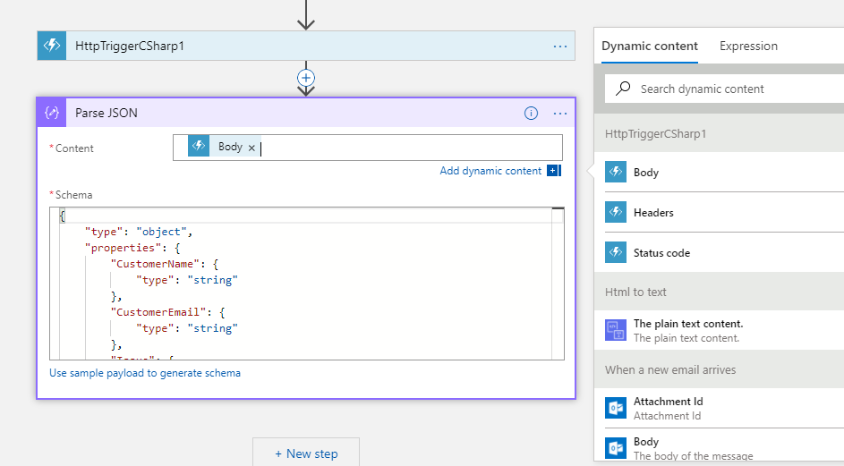  
1. Save the logic app
1. You can resubmit the last run (or run another email) to make sure the parse is working.

Next we will add a custom Event Grid topic to emit these events to.

## Creating a custom Azure Event Grid topic

Let's create a custom event grid topic to emit an event that a customer support email was received.

1. Click the **Cloud Shell** icon on the top of the screen and get a terminal working (may require creating a storage account)  
    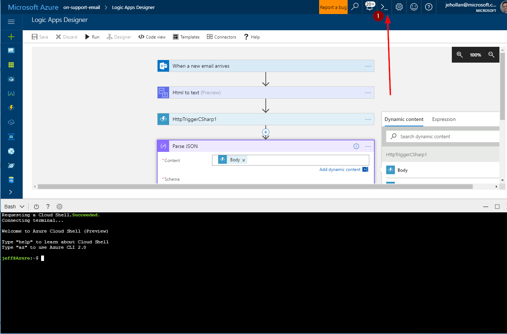  
1. You may need to set the right subscription ID if you have multiple subscriptions:
    ```
    az account set -s <yourSubscriptionId>
    ```
1. Type in the following command:
    * `gridResourceGroup` should be the name of the resource group your Function/Logic App are in
    * `name` needs to be **globally unique**
    ```
    az eventgrid topic create --name <name> -l westus2 -g <gridResourceGroup>
    ```
    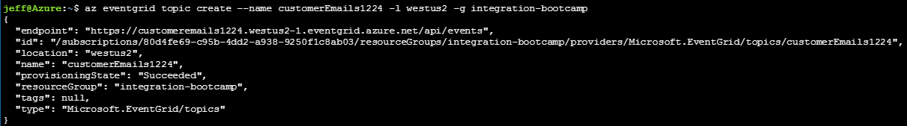  
1. Copy the endpoint from the response (in the screenshot mine was `https://customeremails1224.westus2-1.eventgrid.azure.net/api/events`) and save it for future reference.  **You may need to right-click "copy" as Ctrl+C doesn't always work in console emulator**
1. Enter the following command to get a key to send events:
    * `gridResourceGroup` should be the name of the resource group your Function/Logic App are in
    * `name` needs to be the name created above
    ```
    az eventgrid topic key list --name <name> -g <gridResourceGroup> --query "key1" --output tsv
    ```
    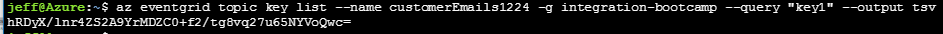
1. Copy the key and save it for future reference.

We now have a custom Event Grid topic we can send events to.

## Sending events to the Event Grid

1. Close the cloud shell and go back to your logic app editor.
1. Add a new action and select the **Azure Event Grid Publish** connector and the **Publish Event** action.
1. Give it any name you want (`CustomerEmail` is fine), and paste in the endpoint and key from the previous section.  
    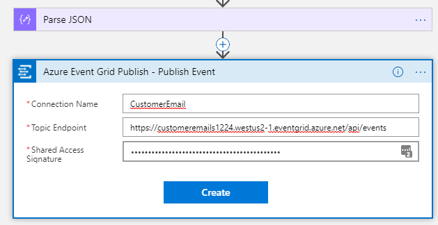  
1. For the ID of the event, select the **Expression** tab and use the `guid()` expression to generate a GUID.  
    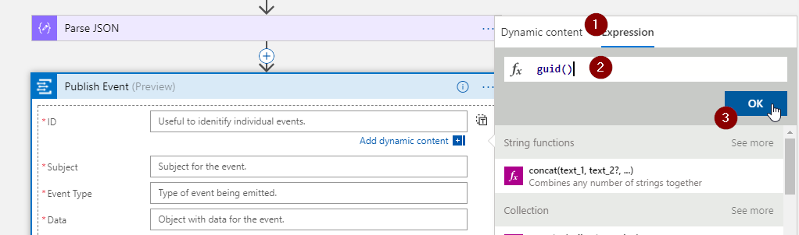  
1. The subject is the subject of the event.  For resource events this would be the Azure Resource ID.  For this let's use the CustomerName as the subject.
1. The event type would be `CustomerEmail/Support`
1. The data is the data to be included in the event. We could craft an object, but for now let's just pass in the output of the Azure Function (that full object). You could choose either the **Parse JSON** body or the **Function** body.  
    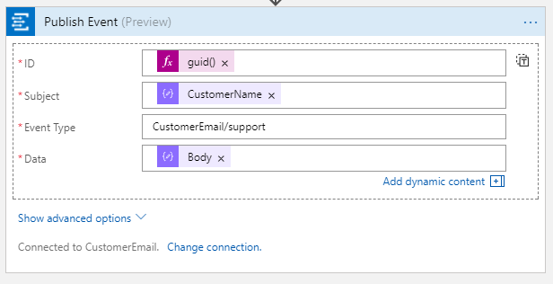  
1. Click **Save**
1. Send a few more emails with the appropriate format to test your serverless app end-to-end.

## Extra Credit

Create a second logic app that will SUBSCRIBE (trigger) on the events from this one.  Perform some action whenever a new support email event occurs.