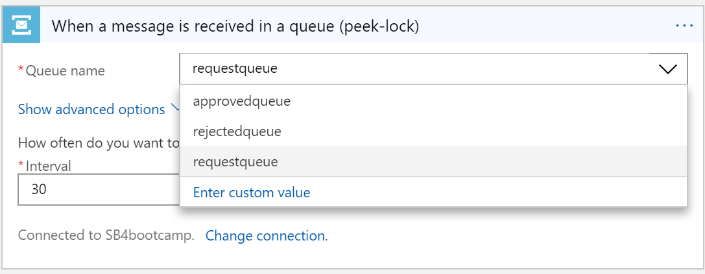
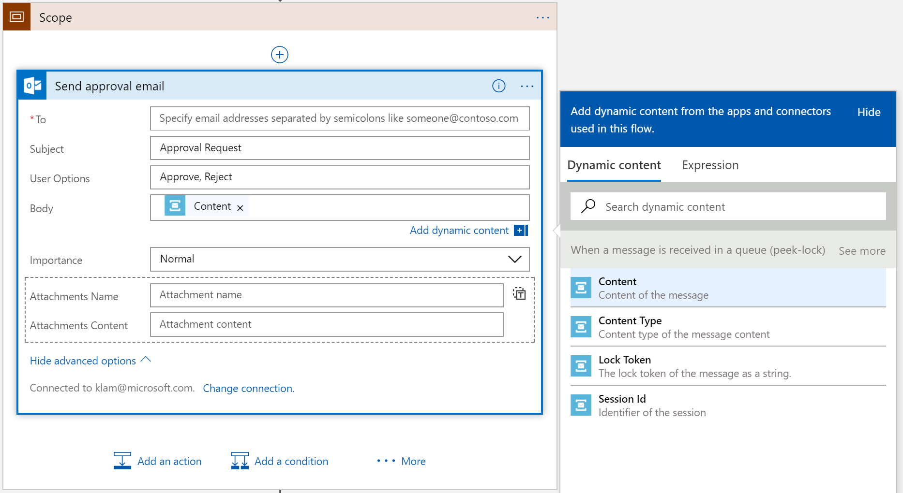

Overview
========

In this lab we will build a long running process that will read a message from a
Service Bus Queue using peek-lock and wait for a user response to determine how
to route the message and will use exception handling in case an error occurs.

Getting started
===============

Go to the [Azure Portal](https://portal.azure.com/) where we will create the
resources necessary.

Service Bus
===========

Let’s first create the set of Service Bus queues that will be used in this lab.

1.  Click on the **New** button in the top left of the screen.

2.  Choose **Enterprise Integration** and select **Service Bus** Create.

    

3.  Give the name *logicapp-router*, create a new Resource Group called
    *integration-bootcamp*, and put it in *East US* (you can really put anything
    you want in any of these fields). Choose **Pin to dashboard** for easy
    access in the remainder of the lab, and **Create** the Service Bus
    namespace.

    

4.  Once it is created, it should automatically open (if not, just open it when
    it is done).

5.  On the top of the blade click on **+Queue** to create a new Service Bus
    queue.

    

6.  Give the name *ApprovedQueue* as the name of the queue, you can leave the
    rest of the default settings as is.

    

7.  Create a second queue again by clicking on the **+Queue**.

8.  Give the name *RejectedQueue* as the name of the queue, you can leave the
    rest of the default settings as is.

9.  Create a third queue, again by clicking on the **+Queue**.

10. Give the name *RequestQueue* as the name of the queue, you can leave the
    rest of the default settings as is.

Logic App
=========

Let’s now create the Logic App.

1.  Click on the **New** button in the top left of the screen.

2.  Choose **Enterprise Integration** and select **Logic App** Create.

    

3.  Give the name *MessageRouter*, use the same resource group you created the
    Service Bus namespace in, *integration-bootcamp*, and put it in **East US**
    (again you can use any values you prefer in any of these fields). Choose
    **Pin to dashboard** for easy access in the remainder of the lab, and
    **Create** the logic app.

    

    Once it’s created, it should automatically open (if not, just open it when
    it’s done). If you aren’t in the designer after opening, click the **Edit**
    button on the command bar to open the Logic App designer.

    Logic Apps is the Serverless orchestration and workflow component. It will
    trigger and route data to the appropriate endpoints. We will build a logic
    app to trigger when a new message arrives on a Service Bus queue, send a
    request to determine what should be done with the message. Depending on the
    reply we will route the message to the appropriate destination queue. We
    will also use exception handling to catch any errors that may occur during
    processing. We will build this out in phases so that you can check your
    progression.

Get Service Bus Queue messages using Peek-Lock
==============================================

The Service Bus connector can read messages from either a queue or a topic
subscription. When reading messages from Service Bus entities it requires you to
commit that you have handled the message. The Service Bus connector provides the
ability to either auto-complete the message after being read from the queue or
to peek at the message with a lock which prevents others from reading the
message until it is completed or abandoned allowing another consumer to read the
message.

First, we will read a message from the queue using peek-lock and then complete
the message using Complete.

1.  Scroll down to select the **Blank Logic App** template.

2.  Select the **Service Bus** connector and choose the trigger **Service Bus –
    When a message is received in a queue (peek-lock)**.

    

3.  Enter a name for the connection and choose the namespace that you created
    earlier. Then choose a Service Bus Policy. The default
    *RootManagedSharedAccessKey* will be sufficient. Then select **Create**.

4.  From the **Queue name** drop down select the *requestqueue* that you had
    created earlier and under the **How often do you want to check for items?**
    configure the polling **interval** to *30* and the **frequency** to
    *seconds*. 30 seconds is the most frequent setting needed to have the logic
    app respond imimagestely when a message is in the queue.

    

5.  Select **+ New step** and choose the **Service Bus** connector.

6.  Scroll down and select the **Complete the message in a queue** operation.

7.  For the **Queue name** property choose the *requestqueue* and for the **Lock
    token of the message** select the **Lock Token** token from the dynamic
    content list that belongs to the trigger action that instantiated this
    instance of the logic app.

    

8.  Click **Save** from the command bar.

Now you have a working logic app that will read messages from a Service Bus
queue using peek-lock.

Send approval and route request
===============================

Now we will send the message to someone to decide what to do with the request.
Depending on their response, we will route the message to the appropriate queue.

1.  Click the **+** between the trigger and action and select **Add a scope**.

    

2.  Select **Add an action** at the bottom of the scope.

3.  Type *Send an approval* in the search box. The search result should include
    results for two connectors; **Office 365 Outlook** and **Outlook.com**.
    Select the **Office 365 Outlook** connector if you will be using a corporate
    AD based account otherwise if you have an MSA, or personal outlook.com based
    email, select the **Outlook.com** connector.

4.  Sign in with your credentials.

5.  In the **Send approval email** action enter in your email address in the
    **To** field.

6.  Select the **Show advanced properties**.

7.  In the **Body** property select the **Content** property from the **When a
    message is received in a queue (peek-lock)**.

    

    1.  This will send an email message that will wait until the recipient to
        chooses either **Approve** or **Reject**. When the recipient selects one
        of those options it will send a request back to this instance of the
        logic app and the logic app will continue.

8.  Select **Add a condition** at the bottom of the scope.

9.  In the first condition property select the **SelectedOption** token, which
    contains the response from the previous step, then select **is equal to**,
    as the conditional operator and finally enter the string *Approve* as the
    value to compare to.

10. If the request was approved then we will want to send it to the
    appovedqueue. In the **If true** scope select **Add an action**.

11. Select the **Service Bus** action then select the **Service Bus - Send
    message** operation.

12. In the **Send message** action enter *approvedqueue* for the value of
    **Queue/Topic name**. Also select the **Content**, **Content Type**, and
    **Properties** from the original message.

13. If the request was rejected then we will want to send it to the
    rejectedqueue. In the **If false** scope select **Add an action**.

14. Select the **Service Bus** action then select the **Serice Bus – Send
    message** operation.

15. In the **Send message** action enter *rejectedqueue* for the value of
    **Queue/Topic name**. Also select the **Content**, **Content Type**, and
    **Properties** from the original message.

16. Click **Save** from the command bar.

>   After completing the steps above the condition should look like the
>   following:

>   LogicAppCondition.png

>   \<image LogicAppCondition\>

Exception handling
==================

In case something goes wrong we want our logic app to handle the error. To
accomplish that we will add parallel action after the scope and change the run
after behavior so that it would only execute if there was a problem executing
any of the actions within the scope.

Let’s handle the case when one of the steps has a failure. In this case we want
to move the message to a dead letter queue as the message could be malformed and
we don’t want to continually process and fail this same message.

1.  After the **Scope** action select the **+** icon.

2.  Scroll down to **Add a parallel branch \>** and then select **Add an
    action**.

3.  Select the **Service Bus** connector, then select the **Service Bus –
    Dead-letter the message in a queue** operation.

4.  For the **Queue name** property choose the *requestqueue* and for the **Lock
    token of the message** select the **Lock Token** token from the dynamic
    content list that belongs to the trigger action that instantiated this
    instance of the logic app.

5.  In the upper right-hand corner of the action select the ellipses **…** and
    then select the **Configure run after** option.

6.  Deselect the **is successful** check box and select the **has failed** check
    box and then select **Done**.

    

7.  Click **Save** from the command bar.

You now have a complete Logic App that does approval, message routing and
exception handling.

Let’s see it work
=================

To try out the logic app we just need to add a message to the request queue. We
can accomplish this by using the Service Bus Explorer.

Service Bus Explorer
--------------------

So that we can easily add and monitor messages in queues, we will use the
ServiceBusExplorer. The ServiceBusExplorer can be downloaded from here:
<https://jehollan.blob.core.windows.net/logicapps/ServiceBusExplorer.zip>.

Send a message using the Service Bus Explorer
---------------------------------------------

1.  Connect to your Service Bus Namespace

2.  Right-click on the *requestqueue* and select **Send Messages**.

3.  Type in a string in the **Message Text** text box. For example, *Please
    approve this message*.

4.  Click **Start**.

Approval
--------

Your logic app should have run and sent an approval email.

Open the Approval Request email and click on **Approve**.

The logic apps will then continue and complete by routing the message the
*approvedqueue*.

You should now see the Logic App completed and routed the message to the
**approvedqueue**.
